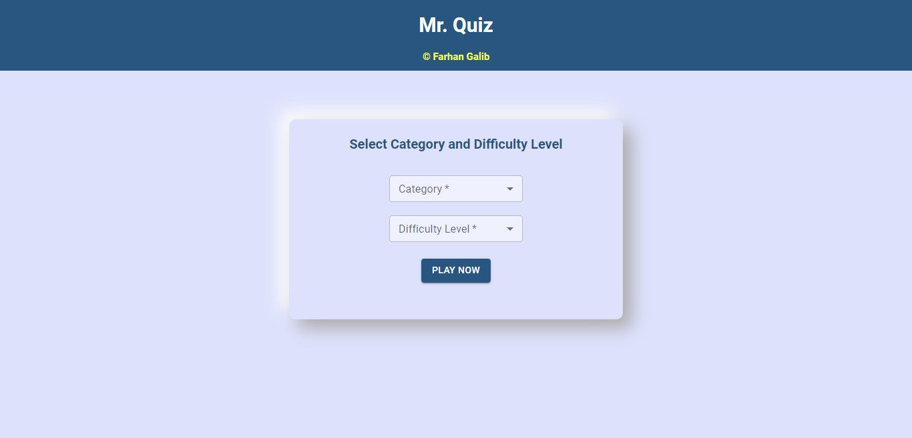
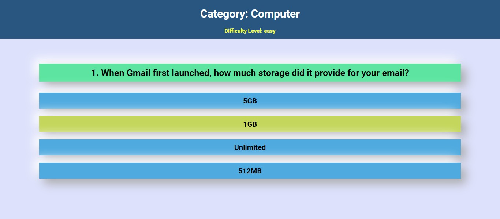
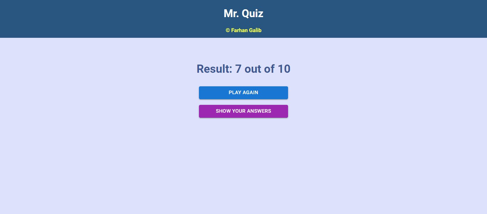
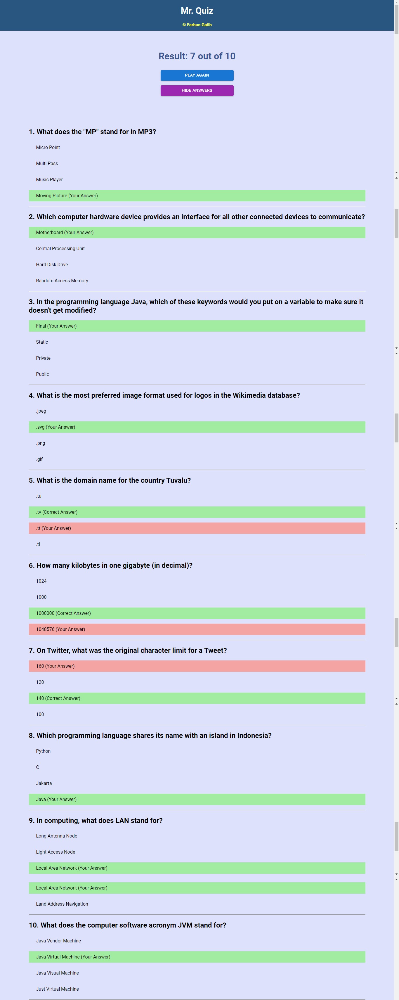

# Mr. Quiz

Mr. Quiz is a quiz application where one can choose category along with the difficulty level (Low, Medium and High) and take part in the quiz. Then 10 quiz questions will be fetched from Trivia API and will be shown one by one. After answering 10th no. question the result page will appear where candidate can see his/her result and also can see the his/her answers and correct answers by simply pressing a button.

## Tools

1. Trivia API
2. React
3. Redux
4. Redux Thunk
5. Material UI
6. Styled Components
7. React Router
8. VS Code

## Pre-requisites

1. Npm

## How To Run

1. At first clone the project.
2. Run `yarn` or `npm install` to install all the dependencies
3. Once installed, run `yarn start` or `npm start`
4. The project will run by default on `3000` port.

## Features

##### Home

1. Choose Category and Difficulty Level.
2. Press play now button to start the game.

##### Quiz

1. Fetch questions from Trivia API dynamically.
2. Ten questions will appear one by one.

##### Result

1. Result will be shown.
2. Can see the answers and correct answers by clicking a button.
3. Can play again by clicking play again button.

## Screenshots

### HomePage

 

### Quiz

### ResultPage

 

### Answers

 

## Website Link

`Website Link:` https://mr-quiz.netlify.app/
